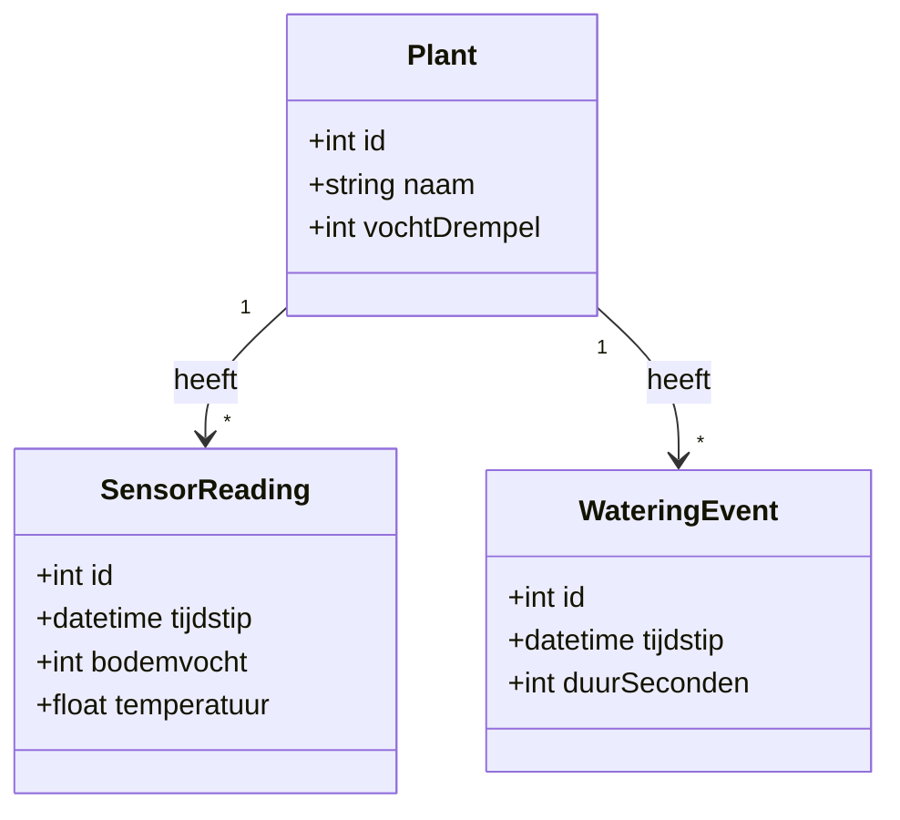

# Smart Plant Watering

IoT-systeem voor automatische plantenbewatering met bodemvocht- en temperatuursensoren, Arduino, MQTT en een .NET MAUI-app.

## Inhoud

- [Probleemstelling](#probleemstelling)
- [Architectuur](#architectuur)
- [Techstack en keuzes](#techstack-en-keuzes)
- [Databasekeuze](#databasekeuze)
- [Concurrency-aanpak](#concurrency-aanpak)
- [Hardware](#hardware)
- [Setup en installatie](#setup-en-installatie)
- [Demo](#demo)
- [Mogelijke uitbreidingen](#mogelijke-uitbreidingen)

## Probleemstelling

Kamerplanten hebben regelmatig water nodig, maar dit wordt in de praktijk vaak vergeten of gebeurt op basis van een inschatting. Hierdoor krijgen planten soms te weinig of juist te veel water, wat hun gezondheid negatief beïnvloedt. Het doel van dit project is om een IoT-systeem te ontwikkelen dat de bodemvochtigheid en temperatuur meet, deze gegevens registreert en op basis van een ingestelde drempel automatisch een plant kan bewateren. De scope van het project is beperkt tot één plant, één bodemvochtsensor, één temperatuursensor en één waterpomp, waarbij de gebruiker de metingen en bewateringsacties kan volgen via een .NET MAUI-app.

## Architectuur

### Systeemoverzicht

```text
Arduino UNO
(sensoren, relais, pomp)
        |
        | USB-serial
        v
C# Serial/MQTT-gateway
        |
        | MQTT publish/subscribe
        v
Mosquitto broker
        |
        +-------------------+
        |                   |
        v                   v
.NET MAUI-app          PostgreSQL
(presentatielaag)      (persistente opslag)
```

- **Arduino → Serial/MQTT-gateway**: de Arduino leest de sensoren uit en stuurt de meetgegevens via USB-serial naar de Windows-computer. De gateway kan daarnaast pompcommando's naar de Arduino sturen.
- **Serial/MQTT-gateway → Mosquitto**: de gateway publiceert sensormetingen naar MQTT-topics en abonneert zich op het topic voor pompcommando's.
- **Mosquitto → .NET MAUI-app**: de mobiele applicatie abonneert zich op MQTT-topics en toont actuele sensorwaarden en pompstatus.
- **PostgreSQL**: persistente opslag voor sensormetingen en bewateringsacties.

De gebruikte MQTT-topics en JSON-berichtformaten zijn vastgelegd in
[`docs/mqtt-contract.md`](docs/mqtt-contract.md).

### Klassendiagram (conceptueel model)



### Relationeel schema (logisch model)

Het relationele schema is afgeleid van het klassendiagram en beschreven in
[`docs/relational-schema.md`](docs/relational-schema.md).

## Techstack en keuzes

| Onderdeel | Keuze | Motivatie |
|---|---|---|
| Microcontroller | Arduino UNO R3 | *TODO* |
| App | .NET MAUI | Opvolger van Xamarin, C#-ervaring herbruikbaar |
| Communicatie Arduino ↔ gateway | USB serial | Geen extra hardware nodig, simpel te implementeren |
| Communicatie gateway ↔ backend/app | MQTT (MQTTnet) | Standaardprotocol voor IoT, dekt socketcommunicatie-leerdoel |
| Broker | Mosquitto (lokaal) | Geen internetafhankelijkheid tijdens demo |
| Opslag | PostgreSQL + EF Core | Centrale relationele opslag; PostgreSQL draait als Podman-container met persistente opslag |

## Databasekeuze

Voor de persistente opslag van gegevens is gekozen voor **PostgreSQL**.

Voor het project zijn SQLite en PostgreSQL overwogen. SQLite heeft als voordeel
dat geen aparte databaseserver nodig is en is daardoor eenvoudig te gebruiken
voor lokale opslag. Voor dit project is echter gekozen voor centrale opslag op
de Linux-server.

PostgreSQL wordt als Podman-container uitgevoerd, naast de andere services van
het systeem. De database kan hierdoor gebruikmaken van het bestaande
containernetwerk. De databasegegevens worden opgeslagen in een persistent
volume, zodat deze behouden blijven wanneer de container opnieuw wordt
aangemaakt.

PostgreSQL sluit daarnaast goed aan op het relationele schema met `Plant`,
`SensorReading` en `WateringEvent`.

Hoewel PostgreSQL meer configuratie en beheer vereist dan SQLite, is deze extra
complexiteit binnen dit project beperkt doordat voor de infrastructuur al
Podman-containers worden gebruikt.

### Vergelijking

| Eigenschap | SQLite | PostgreSQL |
|---|---|---|
| Architectuur | Lokale database | Client/server-database |
| Aparte databaseservice | Nee | Ja |
| Centrale opslag | Minder geschikt | Ja |
| Containeriseerbaar | Niet noodzakelijk | Ja |
| Persistentie | Databasebestand | Persistent volume |
| Beheer | Eenvoudig | Meer configuratie |
| Geschikt voor dit project | Ja | **Gekozen** |

## Concurrency-aanpak

De C# Serial/MQTT-gateway voert meerdere taken gelijktijdig uit.

De serial-reader ontvangt continu berichten van de Arduino via USB. Deze berichten moeten verwerkt kunnen worden zonder dat de MQTT-communicatie wordt geblokkeerd.

De MQTT-service publiceert ontvangen sensormetingen naar Mosquitto en verwerkt inkomende pompcommando's.

Voor de communicatie tussen gelijktijdig uitgevoerde taken wordt een thread-safe mechanisme gebruikt, zodat meerdere taken niet tegelijkertijd onveilig dezelfde gedeelde data wijzigen.

De pompstatus moet eveneens gecontroleerd worden wanneer meerdere taken deze status kunnen lezen of aanpassen. Hiermee worden race conditions voorkomen.

De .NET MAUI-app werkt los van de seriële communicatie en ontvangt de relevante gegevens via MQTT.

## Hardware

- Arduino UNO R3
- Bodemvochtsensor (analoog)
- DHT11 (temperatuur)
- 5V relaismodule
- Dompelpomp 3-6V (Cerioll) + slang
- Batterijpack 4x AA (6V) voor de pomp

*Zie het bedradingsschema (los toe te voegen, bv. als afbeelding in `/docs`).*

## Setup en installatie

*TODO:*
1. *Arduino: welke libraries, welke sketch uploaden*
2. *Mosquitto: installatie en configuratie*
3. *Serial/MQTT-gateway: configuratie en starten*
4. *MAUI-app: hoe te builden en te runnen*
5. *Database: connection string / migratie-commando's*

## Demo

*TODO: link naar het demofilmpje (Projectafsluiting).*

## Mogelijke uitbreidingen

- Tweede plant (extra bodemvochtsensor + extra pomp, zelfde architectuur)
- Waterniveausensor in het reservoir (voorkomt droog draaien van de pomp)
- Wireless communicatie Arduino ↔ app (ESP32/Bluetooth) i.p.v. USB serial
