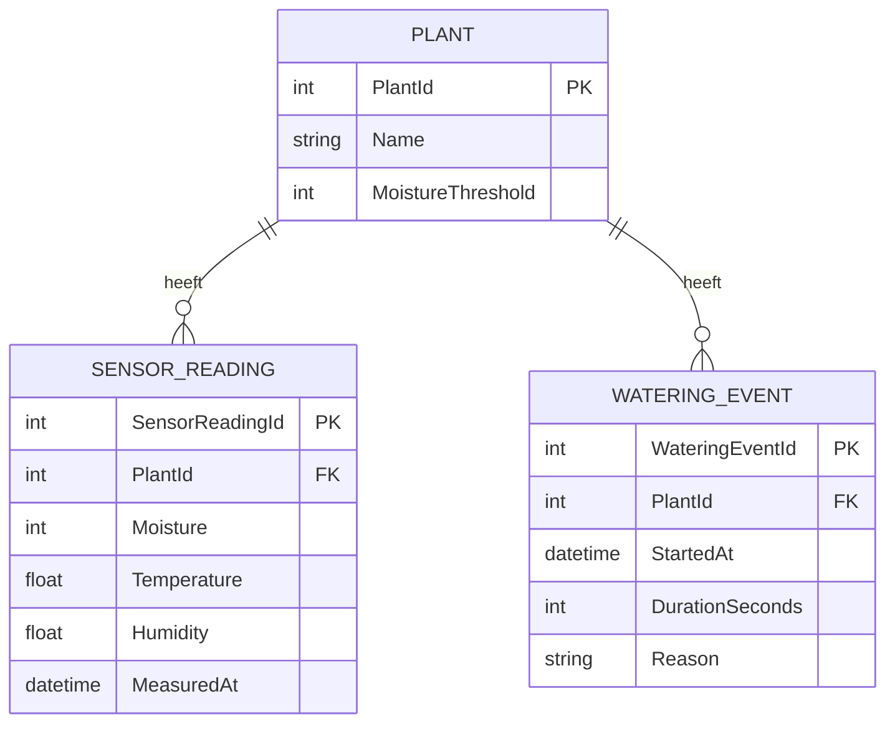

# Relationeel schema

Dit document beschrijft het relationele databaseschema van het Smart Plant Watering-systeem.

Het schema is afgeleid van het klassendiagram met de klassen `Plant`, `SensorReading` en `WateringEvent`.

## Databaseschema

## Tabellen

### Plant

De tabel `Plant` bevat de gegevens van een plant.

`PlantId` is de primaire sleutel en identificeert iedere plant uniek.

### SensorReading

De tabel `SensorReading` bevat de metingen van de sensoren, zoals bodemvocht, temperatuur en luchtvochtigheid.

Iedere meting is gekoppeld aan een plant via `PlantId`.

### WateringEvent

De tabel `WateringEvent` registreert wanneer een plant water heeft gekregen.

Iedere bewateringsactie is gekoppeld aan een plant via `PlantId`.

## Relaties

Een `Plant` kan nul of meerdere `SensorReading`-records hebben. Iedere `SensorReading` hoort bij precies één `Plant`.

Een `Plant` kan nul of meerdere `WateringEvent`-records hebben. Ieder `WateringEvent` hoort bij precies één `Plant`.

`PlantId` in `SensorReading` en `WateringEvent` is een vreemde sleutel (foreign key) die verwijst naar `Plant.PlantId`.
