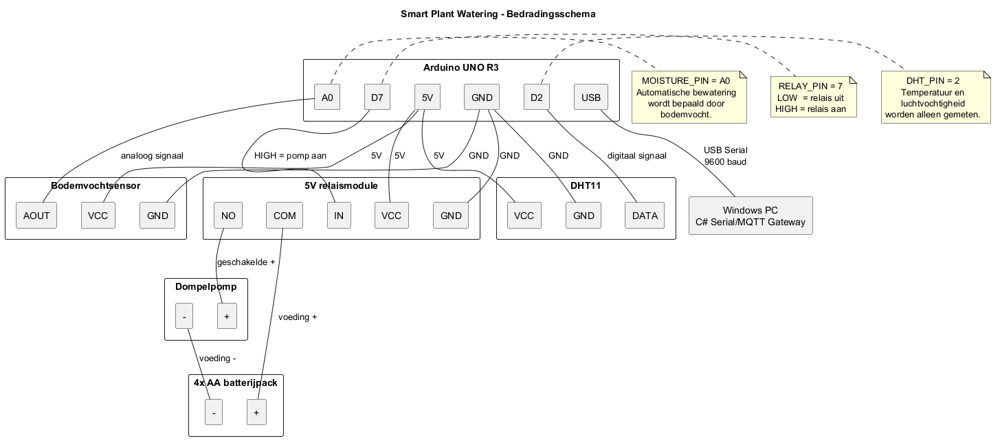

# Bedradingsschema

Onderstaand schema toont de hardwarebedrading van het Smart Plant Watering-systeem.

## Arduino-aansluitingen

| Component | Arduino-aansluiting |
|---|---|
| Bodemvochtsensor AOUT | A0 |
| DHT11 DATA | D2 |
| Relais IN | D7 |
| Sensor/relais VCC | 5V |
| Sensor/relais GND | GND |
| USB Serial | Windows PC, 9600 baud |

De pomp wordt niet rechtstreeks door de Arduino gevoed. De Arduino bestuurt via pin D7 de relaismodule. De externe stroomkring loopt van het batterijpack via `COM` en `NO` van het relais naar de pomp.

De automatische bewatering wordt bepaald door de bodemvochtmeting. Temperatuur en luchtvochtigheid worden gemeten, maar activeren de pomp niet.
